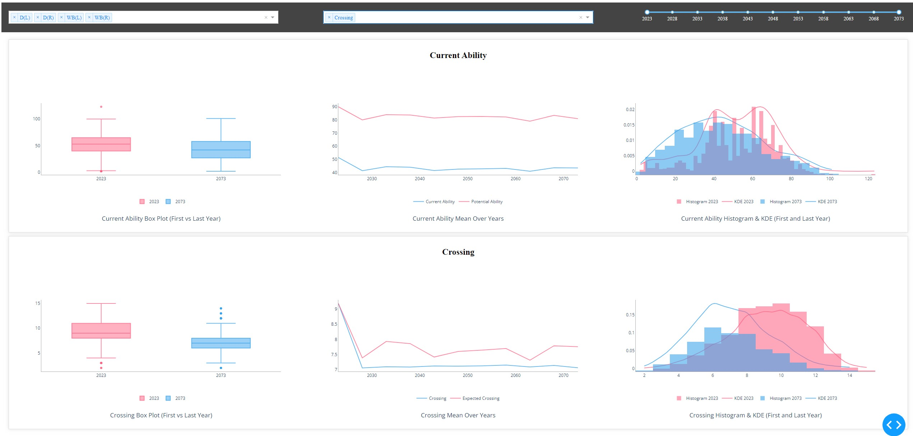

# Football Manager 2024 Svonnalytics Attribute Analysis

## What is this about?
In the recent iterations of Football Manager, there has been much discussion about the quality of newgens, especially about the crossing stat of wingbacks.
I was not able to find anyone who did a thorough analysis on this issue, as most posts about this issue only scraped the surface.
This is why I've ran a test save with >100k players in the DB and created a Dash-based dashboard to analyse the data. 

## CHANGELOG

**09.12.2023**
* First iteration of the attribute analysis dashboard

## Installing, Starting, and Stopping

### Installation
   **Option 1: Use the installer**
   Let this installer do all the work: [Download svonnalytics_attribute_analysis.bat](https://github.com/Svonn/FM-Svonnalytics-Dashboard/releases/download/Alpha-1.0/svonnalytics_dashboard.bat)

   **Option 2: Clone the Repository** 
   Clone the repo, install the requirements and run `app.py`.

### Starting the Dashboard
- Run `svonnalytics_attribute_analysis.bat`.
- This will automatically install all necessary software dependencies and start the dashboard.
- During the startup, you'll be prompted to enter a path for where you want to keep your player data. You can use the default or specify your own.

### Stopping the Dashboard
- To close the program, press `Ctrl+C` in the console or simply close the console window.
